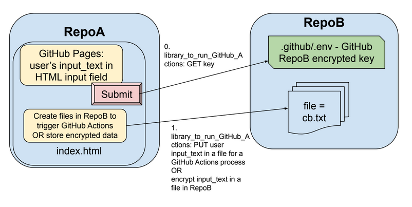

# library_to_run_GitHub_Actions

The purpose of this JavaScript library is to launch Backend processes on GitHub Actions, for Frontend web applications on GitHub Pages. It contains functions that are useful to create web applications using GitHub Pages (a Frontend web application). When calling a model or a database to process a user's input request, the developer must submit the user's data to the model or database using the web application/company keys/tokens on behalf of the user; keys/tokens can either be used from GitHub Secrets on the Backend or they can be encrypted and stored in a file in the repository (ie: Frontend). 

## Specific library function
The library creates a file, in a folder, containing data from the Frontend web application (RepoA), in any repository (RepoB) using RepoB's repository file content key.  The library is called from RepoA on GitHub Pages, it decrypts the repository file content key of RepoB, creates a file with the the user input in RepoB, and can then re-encrypt the key for RepoB. 

This library was inspired by the GitHub workflow called [workflow dispatch event](https://docs.github.com/en/rest/actions/workflows?apiVersion=2022-11-28#create-a-workflow-dispatch-event) that uses the same organizational idea and sends information from RepoA to RepoB.

The intention of the library is to use it to trigger a GitHub Actions workflow (.yaml). When the library creates the file in RepoB (destination repository), a GitHub Actions script (.yaml) will automatically trigger in RepoB (destination repository). The .yaml script can then process user input on the Backend using any programming language (Python, bash, etc), and then save the results to a file in RepoA or RepoB. The webapp frontend can then read the results back to the user.

The purpose of using an intermediate repository, RepoB, is to allow for security to RepoA. RepoB acts as a central repository with non-critical information inside of it; an encrypted file content key which can be recreated, temporary user input messages from Frontend applications, and the .yaml files for triggering processes to run. If an intrusion occured, RepoB would be vunerable to loosing non-critical information, and RepoA would just loose functional communication without loss of critical data. However, despite the benefits of security, sending information from one repository to a different repository via REST API does takes more time, thus resulting in less quick user responses.

## Example of library usage

The library is available at:
- npm: https://www.npmjs.com/package/library_to_run_github_actions
- jsdelivr: https://www.jsdelivr.com/package/npm/library_to_run_github_actions

[Example script for using the library with or without jsdelivr CDN] https://codesolutions2.github.io/library_to_run_GitHub_Actions/index.html 

Inside index.html the following function is called, also different ways in which to import the library are given. Define names of the following variables: Github owner, RepoA, RepoB, the folder to put the created file inside of RepoB, the file to create in RepoB, the text to put inside the created file. This file will be in RepoA.

RepoB should have the following file structure:
- .github
  - .env (encrypted key of repository(RepoA/RepoB) inside)
  - workflows
    - reset_key_automatically.yaml - The workflow uses a github token (with repository file contents read and write permission) from GitHub Secrets; it encrypts the token using base64 encoding, salting (additional strings added), and scrambling.  The encrypted token is saved in the .github/.env file automatically. 
- README.md (optional)

## Library versions
The available functions that can be exported.

### Version 0 (current version)
- export async function run_backend_process(RepoAobj)
- export async function initialize_github(RepoAobj)
- export async function run_env_decode_desalt(RepoAobj)
- export async function encrypt_text_salt_scramble(obj)
- export async function decode_desalt(obj, x_i)
- export async function isbase64(text)
- export async function PUT_create_a_file_RESTAPI(auth, message, content, desired_path, repoName, repoOwner)
- export async function PUT_add_to_a_file_RESTAPI(auth, message, content, desired_path, sha, repoName, repoOwner)
- export async function DELETE_a_file_RESTAPI(auth, message, desired_path, sha, repoName, repoOwner) 
- export async function GET_text_from_file_wo_auth_GitHub_RESTAPI(desired_filename, desired_foldername, repoB_name, repoOwner)
- export async function GET_fileDownloadUrl_and_sha(desired_filename, desired_foldername, repoB_name, repoOwner)
- export async function rand_perm(x)

### Version 1 (in progress)
- async function save_text_input_in_repository_file_process(RepoAobj)
- async function initialize_github(RepoAobj)
- async function decrypt_GitHub_key_from_repository_file(RepoAobj)
- async function encrypt_GitHub_key_and_save_to_repository_file(obj)
- async function encrypt_text_without_salt(obj)
- async function decrypt_text_without_salt(obj)
- async function isbase64(text)
- async function GET_repository_content(auth, desired_path, repoName, repoOwner)
- async function PUT_create_a_file_RESTAPI(auth, message, content, desired_path, repoName, repoOwner)
- async function PUT_add_to_a_file_RESTAPI(auth, message, content, desired_path, sha, repoName, repoOwner)
- async function DELETE_a_file_RESTAPI(auth, message, desired_path, sha, repoName, repoOwner)
- async function GET_text_from_file_wo_auth_GitHub_RESTAPI(desired_filename, desired_foldername, repoB_name, repoOwner)
- async function GET_fileDownloadUrl_and_sha(desired_filename, desired_foldername, repoB_name, repoOwner)
- async function rand_perm(x)

## In progress
- Use a standard method for GitHub encryption instead of salt/scramble: Github recommends using [libsodium-wrappers](https://docs.github.com/en/rest/guides/encrypting-secrets-for-the-rest-api?apiVersion=2022-11-28) to salt and encrypt keys. 
